## **QUESTION 1 - GREEN HOUSES**


### Reading the file


```r
rm(list = ls())
library(dplyr)
```

```
## 
## Attaching package: 'dplyr'
```

```
## The following objects are masked from 'package:stats':
## 
##     filter, lag
```

```
## The following objects are masked from 'package:base':
## 
##     intersect, setdiff, setequal, union
```

```r
library(magrittr)
library(ggplot2)
filename = 'greenbuildings.csv'
setwd("D:/Summer Semester/Intro to Predictive Modelling/Unsupervised/data")
green =  read.csv(filename,header = TRUE)
head(green)
```

```
##   CS_PropertyID cluster   size empl_gr  Rent leasing_rate stories age
## 1        379105       1 260300    2.22 38.56        91.39      14  16
## 2        122151       1  67861    2.22 28.57        87.14       5  27
## 3        379839       1 164848    2.22 33.31        88.94      13  36
## 4         94614       1  93372    2.22 35.00        97.04      13  46
## 5        379285       1 174307    2.22 40.69        96.58      16   5
## 6         94765       1 231633    2.22 43.16        92.74      14  20
##   renovated class_a class_b LEED Energystar green_rating net amenities
## 1         0       1       0    0          1            1   0         1
## 2         0       0       1    0          0            0   0         1
## 3         1       0       1    0          0            0   0         1
## 4         1       0       1    0          0            0   0         0
## 5         0       1       0    0          0            0   0         1
## 6         0       1       0    0          0            0   0         1
##   cd_total_07 hd_total07 total_dd_07 Precipitation  Gas_Costs
## 1        4988         58        5046         42.57 0.01370000
## 2        4988         58        5046         42.57 0.01373149
## 3        4988         58        5046         42.57 0.01373149
## 4        4988         58        5046         42.57 0.01373149
## 5        4988         58        5046         42.57 0.01373149
## 6        4988         58        5046         42.57 0.01373149
##   Electricity_Costs cluster_rent
## 1        0.02900000        36.78
## 2        0.02904455        36.78
## 3        0.02904455        36.78
## 4        0.02904455        36.78
## 5        0.02904455        36.78
## 6        0.02904455        36.78
```

```r
attach(green)
```


The analysis done by 'excel guru' have a few issues. Let's go through them one by one

### ISSUE 1

Challenging the removal of buildings with occupancy rate less than 10%


```r
plot(leasing_rate,Rent)
```

<!-- -->

From the scatter plot above, we can see that there isn't anything weird going on in terms of rent in the buildings with occupany less than 10%. These buildings also have a good range of rents which lead upto 50$ per sqft. So we should consider these buildings in our analysis as well.


### ISSUE 2

The excel guru took the medians between the green buildings and non green buildings. He missed taking a few factors under consideration. 

One such factor is the class of the building. Let's start by creating a single class column which tells us which class the building is in. And then we plot a box plot for all three classes


```r
green$class = ifelse(green$class_a == 1, 'Class A', ifelse(green$class_b == 1, 'Class B', 'Class C'))
boxplot(Rent~green$class)
```

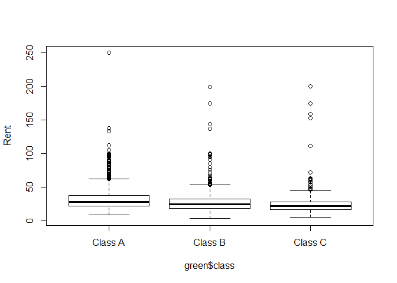<!-- -->

From the box plot above we can see that the rent is different for different classes.With buildings in Class A having the highest rent and Class C buildings having the least rent

Hence the rent of the building depends on the building quality. Let's see how the premiums for green and non green buildings change when class is kept constant


```r
class_groupby = green %>%
  group_by(class,green_rating)%>%
  summarize(mean_rent = mean(Rent),n=n())


ggplot(class_groupby,aes(x=class,y = mean_rent,fill=factor(green_rating)))+
  geom_bar(stat = 'identity', position = 'dodge')+
  labs(x = 'Class of Building')+
  labs(y = 'Average Rent')+
  labs(title = 'Comparing the rents of green vs non green buildings based on class')+
  labs(fill = 'Green/Non Green')
```

<!-- -->


From the graph above we can see that for high quality buildings, the average rent for green buildings is less than the average rent of non green buildings. And for low quality buildings (Class C), the green buildings have a premium. 

Hence it is important to know the quality of material we are going to use for the project


### ISSUE 3

Similar to class, the excel guru forgot to take the age into account. Buildings which are younger tend to charge higher than buildings which are old. And since green buildings are relatively new concepts, their relative age might be less and this might be the reason for the difference in rent

Let's confirm our hypothesis:

Plotting density histograms for green buildings and non green buildings 


```r
ggplot(green)+
  geom_histogram(aes(x = age, y = stat(density),fill=factor(green_rating)),binwidth = 5,)+
  labs(x = 'Age of the building')+
  labs(y = 'Density')+
  labs(title= 'Histogram for age of the building - Green vs Non Green')+
  labs(fill = 'Green/Non Green')
```

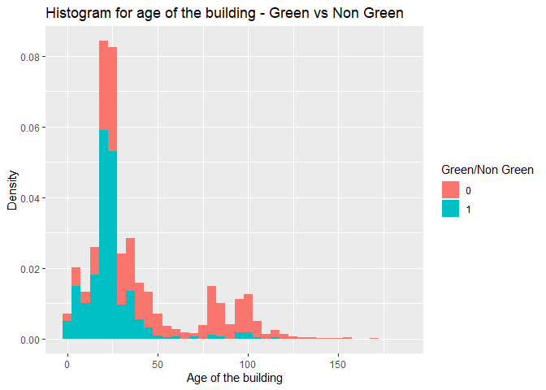<!-- -->

From the charts above we can see that our hypothesis is confirmed. There are more number of non green buildings which are older than 50 years when compared to green buildings.

Let's see how the premium between buildings vary if the age is kept constant


```r
green$agebins = cut(age,c(-1,10,30,50,90,200))

agebins_groupby = green %>%
  group_by(agebins,green_rating)%>%
  summarize(mean_rent = mean(Rent),n=n())


ggplot(agebins_groupby,aes(x=agebins,y = mean_rent,fill=factor(green_rating)))+
  geom_bar(stat = 'identity', position = 'dodge')+
  labs(x = 'Age of the building bins')+
  labs(y = 'Average Rent')+
  labs(title = 'Rents of Green vs Non Green building based on age')+
  labs(fill = 'Green/Non Green')
```

<!-- -->

From the chart above, we can see that for younger buildings, non green buildings have a premium and as the age of the building increases the rent for green buildings is higher.


### ISSUE 4

The excel guru did not take into consideration if the project has any amenities planned or not. Green houses with amenities and without amenities have a different premium over non green houses


```r
green$amenities = ifelse(amenities==1, 'Yes', 'No')

amenities_groupby = green %>%
  group_by(amenities,green_rating)%>%
  summarize(mean_rent = mean(Rent),n=n())


ggplot(amenities_groupby,aes(x=amenities, mean_rent,fill=factor(green_rating)))+
  geom_bar(stat = 'identity', position = 'dodge')+
  labs(x = 'Amenities Provided')+
  labs(y = 'Average Rent')+
  labs(title = 'Comparing the rents of green vs non green buildings based on amenities provided')+
  labs(fill = 'Green/Non Green')
```

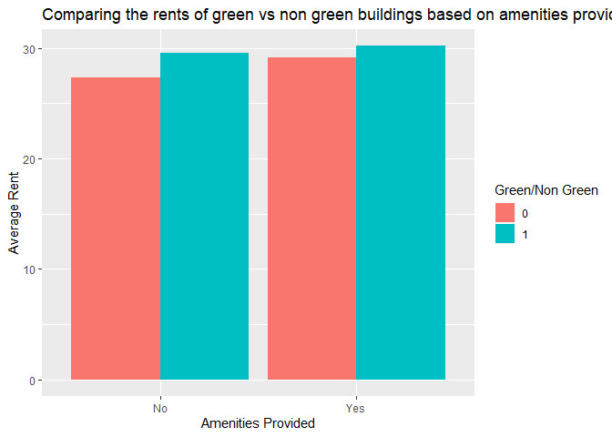<!-- -->

From the chart above, we can see that with amenities provided the green and non green buildings will get almost the same rent


### ISSUE 5

The excel guru failed to take the neighborhood into account. The premium of green houses over non green houses might depend on the neighborhood the buildings are in.

There are a total of 685 clusters which are a lot to look at. Let's group them together based on the 'cluster_rent' to get fewer clusters. The cluster_rent column can act as a proxy for neighborhood because the rent of the cluster will depend on the geographical location of the cluster.

From the graph below, we can see that the green buildings are more left skewed than the non green buildings.


```r
ggplot(green)+
  geom_histogram(aes(x = cluster_rent, y = stat(density),fill=factor(green_rating)),binwidth = 5,)+
  labs(x = 'Cluster Rent')+
  labs(y = 'Density')+
  labs(title= 'Histogram for the Neighborhood - Green vs Non Green')+
  labs(fill = 'Green/Non Green')
```

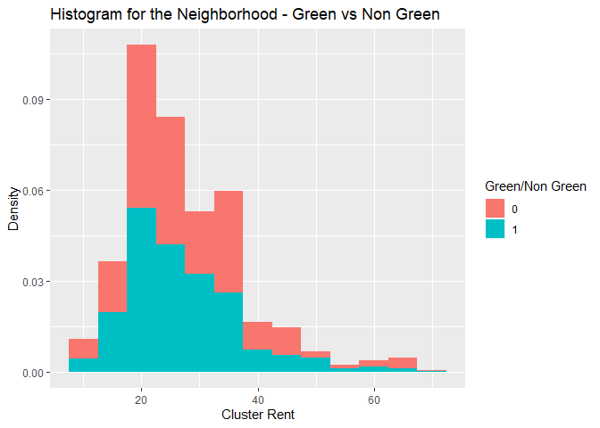<!-- -->

Now let's bucket the buildings based on cluster rent


```r
green$nbhdbins = cut(cluster_rent,c(0,20,30,40,60,100))

nbhdbins_groupby = green %>%
  group_by(nbhdbins,green_rating)%>%
  summarize(mean_rent = mean(Rent),n=n())


ggplot(nbhdbins_groupby,aes(x=nbhdbins,y = mean_rent,fill=factor(green_rating)))+
  geom_bar(stat = 'identity', position = 'dodge')+
  labs(x = 'Cluster rent bins')+
  labs(y = 'Average Rent')+
  labs(title = 'Rents of Green vs Non Green building based on Nbhd')+
  labs(fill = 'Green/Non Green')
```

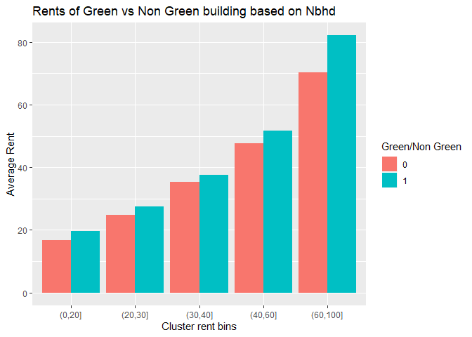<!-- -->


From the chart above, we can see that based on the neighborhood the East Cesar Chavez is in, the premium for Green buildings over Non Green buildings will differ.


### ISSUE 6

The excel guru missed the fact that the number of stories in the building also matters.Let's check if the number of stories should be considered or not


```r
green$strybins = cut(stories,c(0,10,20,35,50,80,120))

strybins_groupby = green %>%
  group_by(strybins,green_rating)%>%
  summarize(mean_rent = mean(Rent),n=n())


ggplot(strybins_groupby,aes(x=strybins,y = mean_rent,fill=factor(green_rating)))+
  geom_bar(stat = 'identity', position = 'dodge')+
  labs(x = 'Number of stories in the building')+
  labs(y = 'Average Rent')+
  labs(title = 'Rents of Green vs Non Green building based on number of stories')+
  labs(fill = 'Green/Non Green')
```

<!-- -->


From the chart above we can see that for a few bins, green houses have a premium and for a few bins they don't. Hence the excel guru should have taken care of this fact as well.

### CONCLUSION

In conclusion, there are a lot of factors which can impact the rent of the building such as the Neighborhood, Building quality (class), Amenities planned etc have not been provided. Hence it is a tough call to make. 

But with the details provided, I would recommend not going ahead with the green buildings as most of the difference in the rent between green and non green buildings is because of the skew in age and class distribution of these two groups.

***

## **QUESTION 2 - ABIA FLIGHTS**

### Reading the file


```r
rm(list = ls())
filename = 'ABIA.csv'
setwd("D:/Summer Semester/Intro to Predictive Modelling/Unsupervised/data")
flights =  read.csv(filename,header = TRUE)
head(flights)
```

```
##   Year Month DayofMonth DayOfWeek DepTime CRSDepTime ArrTime CRSArrTime
## 1 2008     1          1         2     120       1935     309       2130
## 2 2008     1          1         2     555        600     826        835
## 3 2008     1          1         2     600        600     728        729
## 4 2008     1          1         2     601        605     727        750
## 5 2008     1          1         2     601        600     654        700
## 6 2008     1          1         2     636        645     934        932
##   UniqueCarrier FlightNum TailNum ActualElapsedTime CRSElapsedTime AirTime
## 1            9E      5746  84129E               109            115      88
## 2            AA      1614  N438AA               151            155     133
## 3            YV      2883  N922FJ               148            149     125
## 4            9E      5743  89189E                86            105      70
## 5            AA      1157  N4XAAA                53             60      38
## 6            NW      1674   N967N               178            167     145
##   ArrDelay DepDelay Origin Dest Distance TaxiIn TaxiOut Cancelled
## 1      339      345    MEM  AUS      559      3      18         0
## 2       -9       -5    AUS  ORD      978      7      11         0
## 3       -1        0    AUS  PHX      872      7      16         0
## 4      -23       -4    AUS  MEM      559      4      12         0
## 5       -6        1    AUS  DFW      190      5      10         0
## 6        2       -9    AUS  MSP     1042     11      22         0
##   CancellationCode Diverted CarrierDelay WeatherDelay NASDelay
## 1                         0          339            0        0
## 2                         0           NA           NA       NA
## 3                         0           NA           NA       NA
## 4                         0           NA           NA       NA
## 5                         0           NA           NA       NA
## 6                         0           NA           NA       NA
##   SecurityDelay LateAircraftDelay
## 1             0                 0
## 2            NA                NA
## 3            NA                NA
## 4            NA                NA
## 5            NA                NA
## 6            NA                NA
```

### MOST FLOWN AIRLINES:


```r
airline_groupby = flights%>%
  group_by(UniqueCarrier)%>%
  summarize(numflights = length(TailNum))

ggplot(airline_groupby,aes(x=UniqueCarrier,y = numflights))+
  geom_bar(stat = 'identity', position = 'dodge')+
  labs(x = 'Airline Carrier')+
  labs(y = 'Number of Trips')+
  labs(title = 'Number of trips made by airline carriers')
```

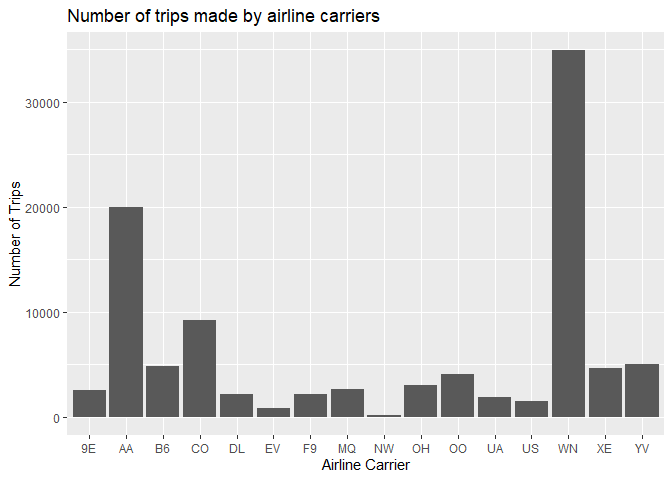<!-- -->

### Adding a new metric - Delaypercent:

Delaypercent = ArrDelay/CRSElapsedTime

this metric gives us the arrival delay in terms of total estimated trip duration. Delay of 10mins in a 1hr flight and delay of 10mins in a 5hr flight are not the same!!

We are considering only the arrival delay because customers care about it mostly. Most times people don't care if the flight departures late.

If the ArrDelay is negative, that means the flight arrived before schduled time, we make the value as zero because we shouldn't consider these when calculating the delay


```r
flights$Delaypercent = (flights$ArrDelay * 100.0)/ flights$CRSElapsedTime
flights$Delaypercent = ifelse(flights$Delaypercent>0, flights$Delaypercent, 0.0)
```


### AIRLINES WITH MOST DELAY:


```r
airlinedelay_groupby = flights%>%
  group_by(UniqueCarrier)%>%
  summarize(avgdelay = mean(Delaypercent,na.rm = TRUE))

ggplot(airlinedelay_groupby,aes(x=UniqueCarrier,y = avgdelay))+
  geom_bar(stat = 'identity', position = 'dodge')+
  labs(x = 'Airline Carrier')+
  labs(y = '% Delay in terms of Trip Duration')+
  labs(title = '% delay by carriers - in terms of Trip Duration')
```

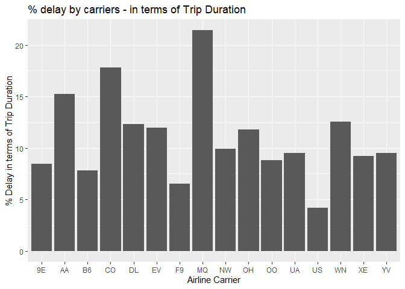<!-- -->

### AIRLINES WITH MOST CANCELLATIONS:


```r
airlinecan_groupby = flights%>%
  group_by(UniqueCarrier)%>%
  summarize(cancellationrate = (sum(Cancelled)*100.0/length(TailNum)))

ggplot(airlinecan_groupby,aes(x=UniqueCarrier,y = cancellationrate))+
  geom_bar(stat = 'identity', position = 'dodge')+
  labs(x = 'Airline Carrier')+
  labs(y = 'Cancellation Rate')+
  labs(title = 'Cancellation rate by carriers')
```

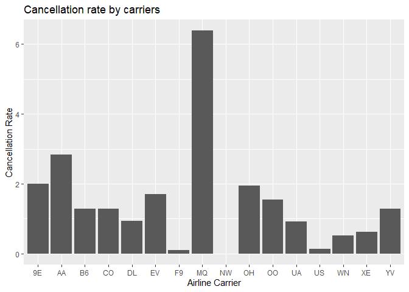<!-- -->


### Delay by Day of the week:


```r
dowdelay_groupby = flights%>%
  group_by(DayOfWeek)%>%
  summarize(avgdelay = mean(Delaypercent,na.rm = TRUE))

ggplot(dowdelay_groupby,aes(x=DayOfWeek,y = avgdelay))+
  geom_bar(stat = 'identity', position = 'dodge')+
  labs(x = 'Day of the Week')+
  labs(y = '% Delay in terms of Trip Duration')+
  labs(title = '% delay by Day of the Week - in terms of Trip Duration')
```

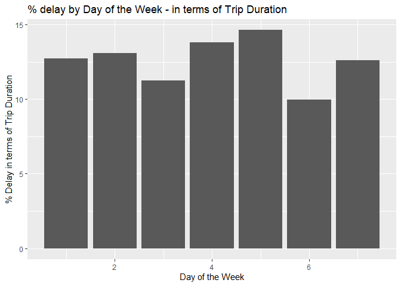<!-- -->


Average delay is almost the same for all the days of the week. Let's see if this is different by airline carriers.


### Delay by airline by Day of the week:


```r
airlinedaydelay_groupby = flights%>%
  group_by(UniqueCarrier,DayOfWeek)%>%
  summarize(avgdelay = mean(Delaypercent,na.rm = TRUE))

ggplot(data = airlinedaydelay_groupby) + 
  geom_bar(mapping = aes(x=DayOfWeek, y=avgdelay), stat='identity') + 
  facet_wrap(~UniqueCarrier)+
  labs(x = 'Day of the week')+
  labs(y = '% Delay in terms of Trip Duration')+
  labs(title = '% Delay by carriers by Day of Week')
```

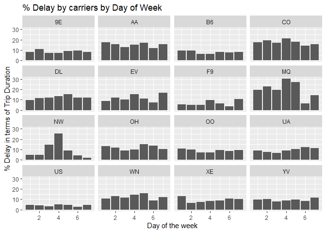<!-- -->

We see that the trend across for the week is same for all carriers except MQ and NW. MQ does relatively better on the weekend and NW does bad in the middle of the week and does better in the remaining days.


### Adding a new columns - departure hour and arrival hour:
Sch_dep_hr = hour from CRSDeptTime
Sch_arr_hr = hour from CRSArrTime


```r
flights$Sch_dep_hr = ifelse(nchar(flights$CRSDepTime)==2,0,
                            ifelse(nchar(flights$CRSDepTime) == 3, substr(flights$CRSDepTime,1,1),substr(flights$CRSDepTime,1,2)))

flights$Sch_arr_hr = ifelse(nchar(flights$CRSArrTime)==2,0,
                            ifelse(nchar(flights$CRSArrTime) == 3, substr(flights$CRSArrTime,1,1),substr(flights$CRSArrTime,1,2)))


flights$Sch_dep_hr = as.numeric(as.character(flights$Sch_dep_hr))
flights$Sch_arr_hr = as.numeric(as.character(flights$Sch_arr_hr))
```


### Adding a new column - DayPart:


DayPart = morning/afternoon/evening/ night/latenight

this metric splits the hours into these 4 parts based on the departure hour

departure hour:
5 - 11 Morning
12 - 18 Afternoon
19 - 20 Night
21 - 4 Late Night


```r
flights$DayPart = ifelse((flights$Sch_dep_hr <=4 | flights$Sch_dep_hr > 21), 'Late Night',
                         ifelse((flights$Sch_dep_hr > 4 & flights$Sch_dep_hr <=11), "Morning",ifelse((flights$Sch_dep_hr > 11 & flights$Sch_dep_hr <= 18),"Afternoon","Night")))
```


### Delay by airline by Part of the day:


```r
airlinedaypartdelay_groupby = flights%>%
  group_by(UniqueCarrier,DayPart)%>%
  summarize(avgdelay = mean(Delaypercent,na.rm = TRUE))

ggplot(data = airlinedaypartdelay_groupby) + 
  geom_bar(mapping = aes(x=DayPart, y=avgdelay), stat='identity') + 
  facet_wrap(~UniqueCarrier)+
  labs(x = 'Part of the day')+
  labs(y = '% Delay in terms of Trip Duration')+
  labs(title = '% delay by Part of the Day - in terms of Trip Duration')+
  coord_flip()
```

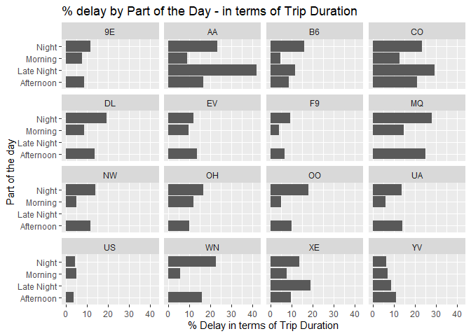<!-- -->

For almost all airlines we are seeing that their night flights are getting delayed.
So be wary when booking a late night fligt!!


### **AIRLINES TO CONSIDER/NOT CONSIDER WHILE TAKING A LATE NIGHT (REDEYE) FLIGHT:**

If the flight departures sometime after 21:00hrs and 4:00hrs we consider it to be a red eye flights.

We usually want to get into the redeye flights and sleep.
So it will be a trouble for us if 
     a)The departure is delayed as we'll have to be awake for a longer time 
     b)The arrival is delayed as we'll be late for our planned tasks upon landing
     


### Adding a new metric - TotalDelaypercent:

TotalDelaypercent = (DepDelay + ArrDelay)/CRSElapsedTime

if either of the DepDelay or ArrDelay is negative, we make that to 0 as we need the total delay. We shouldn't care if the airline made up for the late departure because the customer did face issues because of the delay


```r
flights$TotalDelaypercent = ((ifelse(flights$ArrDelay>0, flights$ArrDelay, 0.0)+ifelse(flights$DepDelay>0, flights$DepDelay, 0.0))*100.0)/ flights$CRSElapsedTime
```


### Adding a new metric - RedeyeFlight:

Now using the departure hour we see if that flight is a red eye flight or not


```r
flights$Redeye = ifelse(flights$DayPart == 'Late Night','RedEye','Normal')
```

### Checking airline performance by redeye and normal flights


```r
redeyedelay_groupby = flights%>%
  group_by(UniqueCarrier,Redeye)%>%
  summarize(avgdelay = mean(TotalDelaypercent,na.rm = TRUE))

ggplot(data = redeyedelay_groupby) + 
  geom_bar(mapping = aes(x=UniqueCarrier, y=avgdelay), stat='identity') + 
  facet_wrap(~Redeye)+
  labs(x = 'Airline Carrier')+
  labs(y = '% Delay in terms of Trip Duration')+
  labs(title = 'Delay by carriers by Flight type')
```

<!-- -->

### We see that AA,CO and XE have unusally high delays for their redeye flights. You might want to stay away from them. Choose a B6 or YV flight if it's available in your route!!!


### **AIRLINES TO CONSIDER/NOT CONSIDER FOR PROFESSIONALS:**

If the flights arrive some time in the morning between 7:00 and 10:00 during the weekday, most probably it is preferred by professionals who are attending a business meeting. They would not like their flight to be delayed.

We should look at only the arrival delay here as they wouldn't be that concerned if they flight departed late

But first, we are adding a column which classifies the flights accordingly:


### Adding a new metric - Professionals:

Now using the arrival hour and arrival day, we see if that flight is preferred for professionals or not


```r
flights$DayOfWeek = as.numeric(as.character(flights$DayOfWeek))


flights$Professional = ifelse((flights$Sch_arr_hr >= 7 & flights$Sch_arr_hr <= 10 & flights$DayOfWeek >= 1 & flights$DayOfWeek <= 5),"Professional","Normal")
```

### Checking airline performance by professional and normal flights


```r
profdelay_groupby = flights%>%
  group_by(UniqueCarrier,Professional)%>%
  summarize(avgdelay = mean(Delaypercent,na.rm = TRUE))

ggplot(data = profdelay_groupby) + 
  geom_bar(mapping = aes(x=UniqueCarrier, y=avgdelay), stat='identity') + 
  facet_wrap(~Professional)+
  labs(x = 'Airline Carrier')+
  labs(y = '% Delay in terms of Trip Duration')+
  labs(title = 'Delay by carriers by Professionals preferred')
```

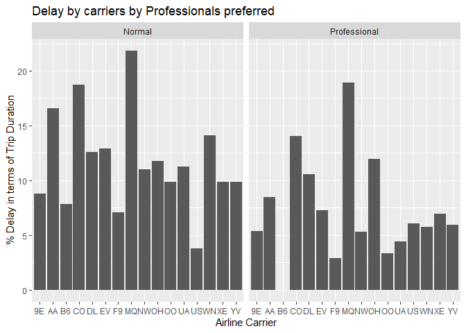<!-- -->

If you have meetings scheduled and don't want be late for them, better not take a CO or MQ or OH flight!!


### **AIRLINES TO CONSIDER/NOT CONSIDER FOR PEOPLE WITH WEEKEND TRIPS:**

If the flights arrive on a friday or during Saturday morning before 11:00 hrs, most probably it has people who are planning on weekend trips

In this case, the last thing when you want to happen is a flight cancellation.Hence for this analysis we are looking at the flight cancellations

First, we are adding a column which classifies the flights accordingly:

### Adding a new metric - Weekend trip goers:

Now using the arrival hour and arrival day, we see if the flight is preferred by people going for weekend trips


```r
flights$Weekendtrips = ifelse(flights$DayOfWeek == 5 | (flights$DayOfWeek == 6 & flights$Sch_arr_hr < 11),"Weekend Trip Goers","Normal")
```


### Checking airline performance by weekend trips and normal flights


```r
weekendtripsdelay_groupby = flights%>%
  group_by(UniqueCarrier,Weekendtrips)%>%
  summarize( cancellationrate = (sum(Cancelled)*100.0/length(TailNum)))

ggplot(data = weekendtripsdelay_groupby) + 
  geom_bar(mapping = aes(x=UniqueCarrier, y=cancellationrate), stat='identity') + 
  facet_wrap(~Weekendtrips)+
  labs(x = 'Airline Carrier')+
  labs(y = 'Avg Cancellation Rate')+
  labs(title = 'Cancellation rates for Flights with weekend trip goers')
```

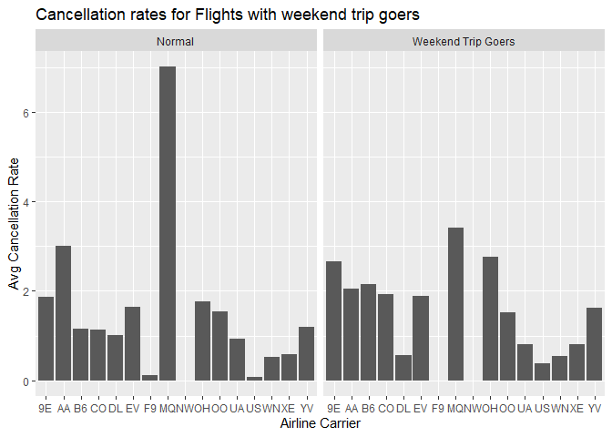<!-- -->

If you have a fun weekend scheduled with your family/friends don't book a ticket in 9E,MQ or OH airlines and avoid dissapointment!!

***

## **QUESTION 3 - PORTFOLIO**


### **Portfolio 1: 'Aggressive Portfolio'**
### Modern Portfolio Theory like all investment theories attempts to maximize the expected rate of return while minimizing the risk. The portfolio chosen here relies on the principles discussed in 'A Random Walk down Wall Street by Burton Malkiel. A percentage of the portfolio is invested in Developed Markets (Germany, UK, Japan) Emerging Markets (India, China). This is to prevent home bias and to diversify the holdings. The portfolio would qualify as Aggresive with the following distribution
### US Equity(VTI) - 35% 
### Developed Markets(VEA) - 27%
### Emerging Markets(VWO) - 18%
### Dividend Stocks(VIG) - 9%
### Bonds(SCHZ) - 11%


```r
portfolio1 = c("VTI", "VEA", "VWO","VIG","SCHZ")
```

### Obtain the data from 30th April 2014

```r
getSymbols(portfolio1,from = "2014-04-30")
```

```
## 'getSymbols' currently uses auto.assign=TRUE by default, but will
## use auto.assign=FALSE in 0.5-0. You will still be able to use
## 'loadSymbols' to automatically load data. getOption("getSymbols.env")
## and getOption("getSymbols.auto.assign") will still be checked for
## alternate defaults.
## 
## This message is shown once per session and may be disabled by setting 
## options("getSymbols.warning4.0"=FALSE). See ?getSymbols for details.
```

```
## [1] "VTI"  "VEA"  "VWO"  "VIG"  "SCHZ"
```


### Get close to close of an object in the portfolio

```r
for(ticker in portfolio1) {
  expr = paste0(ticker, "a = adjustOHLC(", ticker, ")")
  eval(parse(text=expr))
}
all_returns = cbind(ClCl(VTIa),
                     ClCl(VEAa),
                     ClCl(VWOa),
                     ClCl(VIGa),
                    ClCl(SCHZa))
all_returns = as.matrix(na.omit(all_returns))
```


### Initial wealth is set to hundred thousand dollars and for a 20-day period, there are three steps being done. (1) calculate returns (2) sum of holdings is updated and (3) re-assign the holdings in proportion of the original weights of the stocks in the portfolio. This is done for everyday of 20 days and repeated for 1000 times.

```r
initial_wealth = 100000
sim1 = foreach(i=1:5000, .combine='rbind') %do% {
  total_wealth = initial_wealth
  weights = c(0.35, 0.27, 0.18, 0.09, 0.11)
  holdings = weights * total_wealth
  n_days = 20
  wealthtracker = rep(0, n_days)
  for(today in 1:n_days) {
    return.today = resample(all_returns, 1, orig.ids=FALSE)
    holdings = holdings + holdings*return.today
    total_wealth = sum(holdings)
    wealthtracker[today] = total_wealth
    holdings = weights * total_wealth
  }
  wealthtracker
}
```

### Sample result is as follows:

```
##               [,1]      [,2]      [,3]      [,4]      [,5]      [,6]
## result.1 101792.94 102394.85 102598.79 103052.75 103015.42 102890.06
## result.2  99535.76 100721.52 100191.47 100591.81 101480.58 101797.58
## result.3  99919.06  99982.02  97840.67  97968.41  97452.85  96501.94
## result.4  99888.62  99873.98 100630.26 100401.04 100532.42 101653.69
## result.5 100790.29 100215.32 100136.42 103178.23 104407.38 104579.17
## result.6  99988.86 101161.70 102095.20 100231.71  99369.06  99133.79
##               [,7]      [,8]      [,9]     [,10]    [,11]    [,12]
## result.1 102819.37 102893.52 102377.51 103884.06 104978.7 105612.3
## result.2 101965.91 102865.64 103257.77 104482.72 104632.7 105485.9
## result.3  96749.67  97318.07  97568.05  97429.13 100217.9 100320.9
## result.4 101847.12 102071.56 102033.98 103352.93 103468.8 102716.2
## result.5 104440.71 104053.02 102578.46 102693.47 101632.4 101618.4
## result.6  99380.84 101469.23 101056.55 100999.77 100943.0 100823.9
##              [,13]     [,14]     [,15]     [,16]     [,17]     [,18]
## result.1 103491.27 103208.79 103749.72 103274.17 103262.21 101786.86
## result.2 105022.50 105197.57 105070.01 105195.40 106229.20 107897.56
## result.3  97448.77  97789.76  97815.28  97128.43  97018.10  96498.13
## result.4 102440.59 102392.98 103587.27 103112.46 103019.98 102857.87
## result.5 103340.88 103016.00 103278.25 104514.23 103951.25 104272.54
## result.6  99299.12  99700.16  99145.19  98492.21  98726.37  99254.55
##              [,19]     [,20]
## result.1 103385.45 102531.90
## result.2 107919.12 108395.83
## result.3  96794.77  93325.21
## result.4 102279.71 102462.09
## result.5 103478.80 103808.13
## result.6 100813.37 100547.96
```

### The Vaue at risk is calculated and a histogram plot shows its distribution.

```r
hist(sim1[,n_days], 25)
```

<!-- -->

```r
loss_fivepercent = quantile(sim1[,n_days]- initial_wealth, 0.05)
cat('There is a 5% probability that we are loosing', loss_fivepercent, "USD with an aggressive portfolio")
```

```
## There is a 5% probability that we are loosing -5131.329 USD with an aggressive portfolio
```


### **Portfolio2: 'Safe portfolio'**
### The Golden butterfly is a portfolio developed by Tyler, an anonymous developer of https://portfoliocharts.com/ that gained some traction, in the investment circles as an alternative to Ray Dalio's 'All Weather Portfolio'. Although the author claims the Golden Butterfly is suited for wealth accumulation over all time frames, the heavily weighted bonds and commodity would make this ideal for managing retirement account. This would qualify as a Safe portfolio and the expected VaR value is less than the 1st portfolio. Below's the distribution for Golden Butterfly.
##Large Cap Blend(IWD) - 20%
##Small Cap Value(JKL) - 20%
##Total Bond(AGG) - 40%
##Gold -20% 


```r
portfolio2 = c("IWD","JKL","AGG","GLD")
```


```r
hist(sim1[,n_days], 25)
```

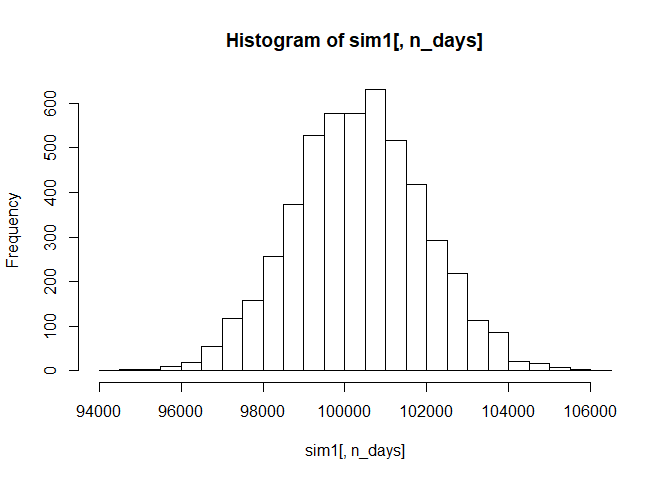<!-- -->

```r
loss_fivepercent = quantile(sim1[,n_days]- initial_wealth, 0.05)
cat('There is a 5% probability that we are loosing', loss_fivepercent, "USD with an safe portfolio")
```

```
## There is a 5% probability that we are loosing -2345.507 USD with an safe portfolio
```


### **Portfolio3:'Diverse portfolio'**
### A custom built portfolio : I put together a portfolio that would be simple and provide diversification in terms of asset classes (Stocks vs Bonds) and Geography (US vs International). For this portfolio, the distribution is
##US Stocks(SPY) - 60%
##International Stocks(SCHC) - 30%
##Bonds(BND) -10% 


```r
portfolio3 = c("BND","SPY","SCHC") 
```


```r
# Profit/loss%
hist(sim1[,n_days], 25)
```

<!-- -->

```r
loss_fivepercent = quantile(sim1[,n_days]- initial_wealth, 0.05)
cat('There is a 5% probability that we are loosing', loss_fivepercent, "USD with a diverse portfolio")
```

```
## There is a 5% probability that we are loosing -4846.947 USD with a diverse portfolio
```

### This was a diverse portfolio in terms of asset classes and was aggressive when compared to portfolio2. So, the VAR turned out to be higher. The reason for the VAR to be close to that of Portfolio1 could be because both the portfolios, though they have a different mix in terms of the type of stocks, they have a similar weight (90%) on stocks.
